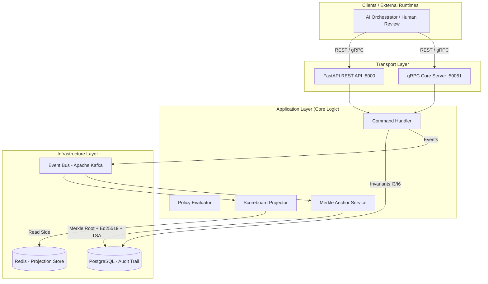

# Decision Intelligence Core

**Domain-Agnostic Decision Intelligence & AI Orchestration Framework**
 
 Высокопроизводительное ядро принятия решений на базе **Event Sourcing**, **CQRS** и криптографического **Merkle-Anchoring** с offline-верифицируемыми доказательствами вхождения (Inclusion Proofs).

## Обзоp системы

**Decision Intelligence Core** — это изолированный, домен-агностический сервис, обеспечивающий детерминированную обработку метрик, проверку регламентов (Policy Evaluation), аудит рисков и криптографическую фиксацию решений.

Система гарантирует полное доказательство неизменяемости данных (Immutability) и обеспечивает детерминированное принятие решений в условиях неполных данных.

### Ключевые возможности:

- **Event Sourcing & CQRS:** Полное разделение контуров записи (`Command Handler` / `Audit Trail`) и чтения (`Scoreboard Projector`).
  
- **Криптографический анкоринг (Merkle Batching):** Автоматическое пакетирование событий в деревья Меркла с генерацией `Ed25519` подписей и `RFC 3161 TSA` штампов времени.

- **Offline-Inclusion Proofs:** Возможность независимой математической проверки наличия любого факта/метрики в зафиксированном блоке без доступа к центральной БД.
  
- **Строгое соблюдение бизнес-инвариантов (I3, I4, I6, I7):** Гарантия идемпотентности, проверка наличия доказательств (Evidence) и корректная обработка устаревания метрик.

- **Dual Transport Layer:** Одновременная поддержка **REST (FastAPI / OpenAPI)** и **gRPC (`google.protobuf.Struct`)** для высоконагруженного межсервисного взаимодействия.

## Архитектура системы

Проект спроектирован по принципам **Clean Architecture** и **Domain-Driven Design (DDD)**. Наружные слои зависят от внутренних, абстракции определены через Python `Protocol`.

## Гарантируемые инварианты ядра:

I3 (Evidence Boundary)

Прием метрики отклоняется (422 / INVALID_ARGUMENT), если список evidence_refs пуст.

реализация:
application/command_handler.py

I4 (Policy Safety)

Неполнота данных не приводит к сбою: политика возвращает INSUFFICIENT_DATA.

реализация:
application/policy_evaluator.py

I6 (Strict Idempotency)

Повторный запрос с существующим idempotency_key возвращает DUPLICATE_IGNORED без записи.

реализация:
infrastructure/memory_adapters.py / DB

I7 (Metric Superseding)

Выпуск новой версии метрики не меняет и не удаляет предыдущие записи в Audit Trail.

реализация:
domain/events.py

## Структура проекта

decision-intelligence-core/
├── domain/                  # Pure Business Logic & Pydantic Models (Zero DB/API deps)
│   ├── events.py            # Event Definitions (_RuntimeEvent)
│   └── models.py            # MetricRecord, ScoreboardState, MerkleProof
├── interfaces/              # Abstractions (Protocols): AuditTrail, Signer, TSA, EventBus
├── application/             # Use Cases & Decision Logic
│   ├── command_handler.py   # Write-side processing & Invariants check
│   ├── merkle.py            # Pure Merkle Tree construction & Proof verification
│   ├── merkle_anchor_service.py # Batching, Ed25519 Signing, TSA Timestamping
│   ├── policy_evaluator.py  # Rule Engine & Policy Execution
│   └── scoreboard_projector.py # Read-side projection rebuilder
├── infrastructure/          # Concrete Implementations (Kafka, Redis, Postgres, Ed25519)
├── api/                     # FastAPI App, Schemas, Dependency Injection
├── grpc/                    # core.proto & Async gRPC Server implementation
└── tests/                   # Verification Scripts & Unit/Integration Test Suite

## Быстрый старт

### Вариант 1: Docker Compose (Full Stack)

Запуск полного окружения с Kafka, Redis, Postgres и сервисами Core:

# 1. Подготовка окружения
cp .env.example .env

# 2. Запуск контейнеров
make docker-up

После запуска доступны:

- **REST API:** http://localhost:8000/docs (Swagger UI)
- **gRPC Endpoint:** localhost:50051

### Вариант 2: Локальная разработка (In-Memory Mode)

Для автономного запуска без внешних инфраструктурных сервисов (используются In-Memory адаптеры):

# 1. Установка зависимостей

make install-dev

# 2. Запуск фундаментальной проверки логики ядра (Без внешних сетей/БД)

make verify-core

# 3. Запуск REST API локально

make run-api

### Вариант 3: GitHub Codespaces

Репозиторий содержит готовую конфигурацию .devcontainer/. При открытии в Codespaces автоматически поднимается закрытый Docker-контур, генерируются gRPC-stubs и разворачивается готовая dev-среда.

## Тестирование и верификация

Система включает двухуровневый контур верификации:

1. **Standalone Core Verification (make verify-core):**
Автономный проверочный скрипт (tests/verify_core_logic_stdlib.py), использующий **только Python stdlib и cryptography**.
    - Выполняет **30+ изолированных проверок**: формулы хэширования листьев, генерацию и порчу деревьев Меркла, проверки offline-proofs, лимиты батчирования, подписи Ed25519 и работу инвариантов I3/I4/I6/I7.

2. **Full Integration Suite (make test):**
Набор pytest-тестов (tests/unit/, tests/integration/) для комплексной проверки async-компонентов, gRPC-контрактов и REST-эндпоинтов.

## Примеры взаимодействия (REST API)

### 1. Отправка метрики (UpdateMetric)

curl -X POST http://localhost:8000/v1/metrics \
-H "Content-Type: application/json" \
-d '{
"decision_id": "dd-8f14e45f",
"metric_name": "kdn_limit_check",
"value": "WITHIN_LIMIT",
"idempotency_key": "dd-8f14e45f-kdn-v1",
"evidence_refs": ["ev-91a4e5f3"],
"proposed_by": "ai-orchestrator",
"runtime_context": {"planner_version": "2.3.0"}
}'

# Response: 202 ACCEPTED {"status": "ACCEPTED"}

**2. Запрос оффлайн-доказательства (Merkle Proof)**

curl "http://localhost:8000/v1/merkle-proof?decision_id=dd-8f14e45f&metric_name=kdn_limit_check"

## Спецификация и расширяемость

- **TSA (Time Stamping Authority):** Модуль infrastructure/rfc3161_tsa.py содержит базовый интерфейс. Реализация парсинга ASN.1 расширяется под конкретные национальные или корпоративные удостоверяющие центры (например, НУЦ РК / КЦМР для банковского профиля).

- **Domain Profiles:** Core-слой принимает runtime_context как универсальный pydantic.JsonValue / google.protobuf.Struct, позволяя поверх ядра подключать специфичные доменные профили (Banking, GameDev, Construction).

